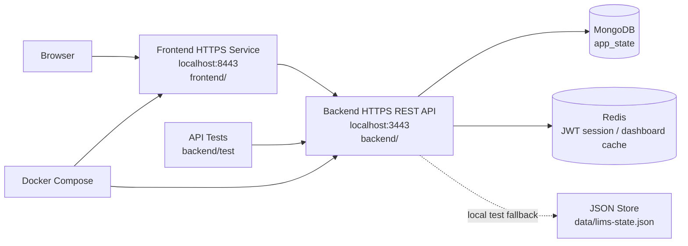
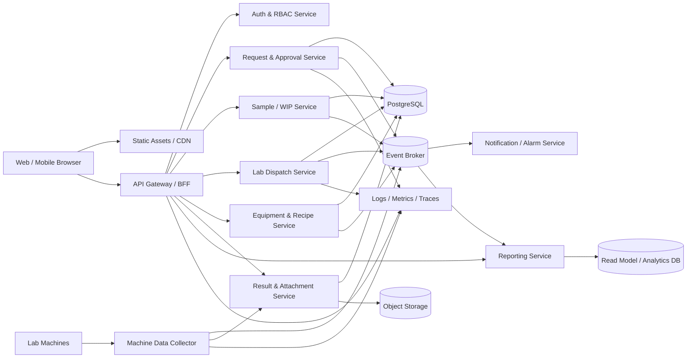
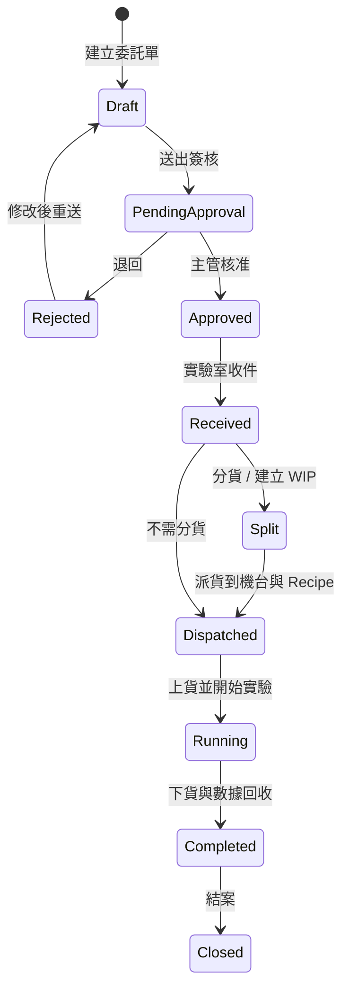

# 雲原生實驗室資訊管理系統架構草案

## 1. 專案定位

本系統以 Cloud-Native Laboratory Information Management System, LIMS 為目標，支援廠區使用者開立實驗委託單、主管簽核、實驗室收件、樣品分貨、派貨到機台與 Recipe、實驗數據回收、結果結案、統計監控與異常告警。

主要角色：

- 廠區使用者：開立委託單、查詢樣品與結果。
- 實驗室人員：收件、分貨、派貨、上下貨、維護操作紀錄。
- 實驗室主管：簽核委託單、檢視統計圖表與異常。
- 系統管理員：管理帳號、角色、機台、Recipe 與系統設定。

## 2. 建議系統架構

目前 MVP 已採前後端分離部署：

期末可再把 backend 內的功能模組逐步替換成資料庫、認證服務、事件 broker 與監控元件。

## 3. 模組切分

| 模組 | 負責能力 | 主要資料 |
| --- | --- | --- |
| Auth & RBAC | 登入、角色權限、操作限制 | Users, Roles, Permissions |
| Request & Approval | 委託單建立、簽核、狀態流轉 | Requests, ApprovalTasks, AuditLogs |
| Sample / WIP | 樣品接收、分貨、樣品歷程追溯 | Samples, WipLots, ChainOfCustody |
| Equipment & Recipe | 機台、Recipe、參數版本管理 | Equipment, Recipes, RecipeVersions |
| Lab Dispatch | 派貨、上貨、下貨、實驗作業排程 | Jobs, Dispatches, LoadHistories |
| Result & Attachment | 結果紀錄、報告附件、機台資料回收 | Results, RawDataFiles, Attachments |
| Notification / Alarm | 簽核通知、機台異常、逾期提醒 | Notifications, AlarmRules |
| Reporting | 機台利用率、委託單統計、人員操作統計 | AggregatedMetrics, Dashboards |

## 4. 核心狀態流程

建議的狀態欄位：

- `request_status`: `draft`, `pending_approval`, `approved`, `rejected`, `received`, `in_progress`, `completed`, `closed`
- `sample_status`: `created`, `received`, `split`, `queued`, `loaded`, `processed`, `returned`
- `job_status`: `queued`, `loaded`, `running`, `unloaded`, `completed`, `failed`
- `equipment_status`: `idle`, `busy`, `maintenance`, `alarm`

## 5. 資料模型初稿

| Entity | 重要欄位 |
| --- | --- |
| User | id, name, department, role, site |
| Request | id, requester_id, lab_type, experiment_goal, priority, due_date, status, created_at |
| ApprovalTask | id, request_id, approver_id, status, comment, decided_at |
| Sample | id, request_id, sample_code, material, quantity, unit, hazard_level, status |
| WipLot | id, parent_sample_id, wip_code, quantity, purpose, status |
| Equipment | id, code, name, lab_area, capability, status, owner_id |
| Recipe | id, equipment_id, name, version, parameters_json, is_active |
| DispatchJob | id, request_id, wip_lot_id, equipment_id, recipe_id, operator_id, status |
| LoadHistory | id, job_id, action, operator_id, occurred_at, note |
| Result | id, job_id, summary, raw_data_uri, report_uri, created_at |
| Alarm | id, equipment_id, severity, message, status, triggered_at, acknowledged_by |
| AuditLog | id, actor_id, target_type, target_id, action, before_json, after_json, occurred_at |

## 6. API 草案

| Method | Path | 用途 |
| --- | --- | --- |
| `POST` | `/api/requests` | 建立委託單 |
| `POST` | `/api/requests/{id}/submit` | 送出簽核 |
| `POST` | `/api/approvals/{id}/approve` | 核准 |
| `POST` | `/api/approvals/{id}/reject` | 退回 |
| `POST` | `/api/requests/{id}/receive` | 實驗室收件 |
| `POST` | `/api/samples/{id}/split` | 樣品分貨 |
| `GET` | `/api/equipment` | 查詢機台 |
| `POST` | `/api/recipes` | 建立 Recipe |
| `POST` | `/api/dispatch-jobs` | 建立派貨任務 |
| `POST` | `/api/dispatch-jobs/{id}/load` | 上貨 |
| `POST` | `/api/dispatch-jobs/{id}/unload` | 下貨 |
| `POST` | `/api/machine-events` | 機台資料回傳 |
| `GET` | `/api/reports/utilization` | 機台利用率 |

## 7. 雲原生與可靠性設計

- 容器化：每個服務包成 Docker image，部署到 Kubernetes。
- API Gateway：集中處理身份驗證、rate limit、request tracing。
- 事件驅動：委託單核准、收件、派貨、機台完成、異常告警都發布 domain event。
- 資料一致性：交易資料以 PostgreSQL 為主，跨服務整合採 Outbox Pattern 與 idempotency key。
- 檔案儲存：大型 raw data、實驗報告放 Object Storage，DB 只保存 URI 與 metadata。
- 可觀測性：OpenTelemetry tracing、Prometheus metrics、Grafana dashboard、集中式 logs。
- CI/CD：Pull request 觸發 lint、test、build；main branch 自動部署 staging；tag 部署 production。
- 安全性：RBAC、最小權限、敏感參數加密、audit log、輸入驗證、檔案上傳掃描。
- 擴展性：Reporting 使用 read model，避免統計查詢影響核心交易；Machine Collector 可水平擴展。

## 8. 建議 MVP 範圍

第一階段先完成可展示的核心閉環：

1. 廠區使用者建立委託單與樣品。
2. 主管核准或退回。
3. 實驗室人員收件。
4. 建立 WIP 或直接派貨。
5. 選擇機台與 Recipe，記錄上貨與下貨。
6. 模擬機台回傳結果，自動結案。
7. Dashboard 顯示待簽核、待收件、機台狀態、利用率與異常。
