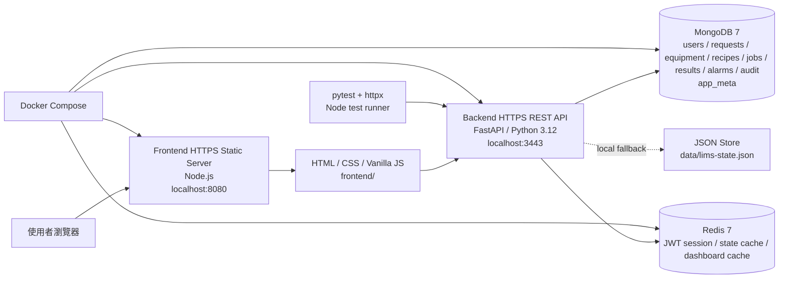
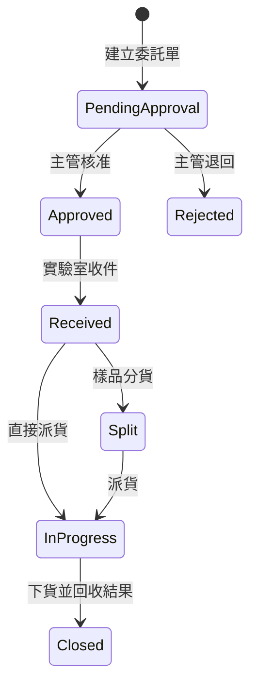

# 目前系統架構

本文件描述目前已實作的 Cloud-Native LIMS Prototype。目標是讓團隊與評審能快速理解：系統現在能跑什麼、用了哪些技術、資料怎麼流、測試與部署做到什麼程度。

## 1. 系統定位

本系統是雲原生實驗室資訊管理系統（Cloud-Native Laboratory Information Management System, LIMS）的 MVP。已支援一條可展示的核心閉環：

```text
登入 -> 建立委託單 -> 主管簽核 -> 實驗室收件 -> 樣品分貨 -> 派貨到機台與 Recipe -> 上貨 -> 下貨 -> 回收結果 -> 自動結案 -> 告警處理
```

目前採前後端分離、容器化、FastAPI 後端、MongoDB 持久化、Redis session/cache、pytest 與 Node frontend tests。

## 2. 部署架構



### 目前服務

| 服務 | 技術 | Port | 說明 |
| --- | --- | ---: | --- |
| Frontend | Node.js static server, HTML/CSS/Vanilla JS | `8080` | 提供單頁操作介面與 `/config.js` runtime API 設定 |
| Backend | FastAPI, Python 3.12, Uvicorn | `3443` | 提供 REST API、JWT、RBAC、狀態流程 |
| MongoDB | `mongo:7` | `27017` | Docker Compose 模式主要資料庫 |
| Redis | `redis:7-alpine` | `6379` | JWT session、state/dashboard cache |

## 3. 程式結構

```text
backend/
  app/
    main.py          FastAPI app factory 與目前所有 API routes
    auth.py          JWT、password hash、Bearer token、RBAC helper
    cache.py         Redis / Noop cache abstraction
    config.py        env var 與 TLS / port / DB 設定
    dashboard.py     dashboard aggregation
    domain.py        entity lookup、audit、狀態驗證 helper
    errors.py        API error type
    seed.py          demo users 與初始資料
    store.py         JSON store / MongoDB store / migration
  tests/
    test_api.py      API/RBAC/流程/狀態規則測試
    test_store.py    Mongo collection layout 與 legacy migration 測試

frontend/
  index.html         單頁 UI
  app.js             UI state、API client、render/action handlers
  styles.css         RWD 與視覺樣式
  server.js          HTTPS/static server 與 config.js
  tests/
    server.test.js   frontend static server 測試

docker-compose.yml   frontend / backend / mongo / redis
.github/workflows/ci.yml
```

## 4. 角色與權限

| 角色 | 帳號 | 權限 |
| --- | --- | --- |
| 廠區使用者 | `fab` | 建立委託單、查詢 |
| 實驗室主管 | `supervisor` | 核准 / 退回委託單 |
| 實驗室人員 | `operator` | 收件、分貨、派貨、上下貨、機台狀態、告警確認 |
| 系統管理員 | `admin` | 管理 Recipe、重置 demo data；admin 可通過所有 RBAC 檢查 |

除 `GET /api/health` 與 `POST /api/auth/login` 外，所有 `/api/*` 都需要 `Authorization: Bearer <JWT>`。

## 5. 核心狀態流程



目前後端已補狀態驗證：

- 只有 `pending_approval` 可 approve/reject。
- 只有 `approved` 可 receive。
- 只有 `received` 可 split。
- 只有 `received` 或 `split` 可 dispatch。
- job 只有 `queued` 可 load，只有 `running` / `loaded` 可 unload。

## 6. 主要 API

| Method | Path | 權限 | 說明 |
| --- | --- | --- | --- |
| `GET` | `/api/health` | public | 健康檢查 |
| `POST` | `/api/auth/login` | public | 登入取得 JWT |
| `GET` | `/api/auth/me` | authenticated | 查目前登入者 |
| `POST` | `/api/auth/logout` | authenticated | 登出並撤銷 Redis session |
| `GET` | `/api/state` | authenticated | 取得完整 demo state |
| `GET` | `/api/dashboard` | authenticated | Dashboard aggregation |
| `GET` | `/api/audit?limit=20` | authenticated | 查操作歷程 |
| `POST` | `/api/requests` | `fab` | 建立委託單 |
| `POST` | `/api/requests/{id}/approve` | `supervisor` | 核准 |
| `POST` | `/api/requests/{id}/reject` | `supervisor` | 退回 |
| `POST` | `/api/requests/{id}/receive` | `operator` | 實驗室收件 |
| `POST` | `/api/requests/{id}/split` | `operator` | 自動分貨 |
| `POST` | `/api/dispatch-jobs` | `operator` | 派貨到機台與 Recipe |
| `GET` | `/api/dispatch-jobs/{id}/history` | authenticated | 查上下貨歷史 |
| `POST` | `/api/dispatch-jobs/{id}/load` | `operator` | 上貨 |
| `POST` | `/api/dispatch-jobs/{id}/unload` | `operator` | 下貨、產生 result、自動結案 |
| `POST` | `/api/equipment/{id}/status` | `operator` | 更新機台狀態 |
| `POST` | `/api/recipes` | `admin` | 新增 Recipe |
| `GET` | `/api/results` | authenticated | 查結果 |
| `GET` | `/api/results/{id}` | authenticated | 查單筆結果 |
| `POST` | `/api/alarms/simulate` | `operator` | 模擬告警 |
| `POST` | `/api/alarms/{id}/ack` | `operator` | 確認告警 |
| `POST` | `/api/reset` | `admin` | 重置 demo data |

## 7. 資料儲存

Docker Compose 模式使用 MongoDB，資料拆成多個 collection：

```text
users
requests
equipment
recipes
jobs
results
alarms
audit
app_meta
```

`app_meta` 保存 schema version 與 request/job/recipe/alarm 序號。若舊資料仍在 legacy `app_state` document，後端第一次啟動時會自動遷移到新的 collection layout。

未設定 `MONGO_URL` 時使用 JSON fallback：`data/lims-state.json`。這主要給本機開發與測試使用。

## 8. 測試現況

Root command：

```bash
npm test
```

目前會依序執行：

```bash
npm run test:backend
npm run test:frontend
```

Backend tests：

- `backend/tests/test_api.py`
- `backend/tests/test_store.py`
- 涵蓋 auth、JWT expiry、RBAC、完整 LIMS 流程、狀態轉換、派貨限制、告警、Recipe 管理、Mongo migration。

Frontend tests：

- `frontend/tests/server.test.js`
- 涵蓋 frontend static server、`config.js`、content type、404、405、path traversal 防護。

## 9. 目前限制

| 類別 | 限制 |
| --- | --- |
| Frontend 權限 | UI 仍有角色切換選單，可能與 JWT 角色不一致 |
| Frontend 安全 | 多處使用 `innerHTML` render 使用者輸入，需補 XSS escape |
| WIP 分貨 | 目前為自動 A/B 分貨，尚未支援手動 WIP 數量與用途 |
| Recipe | 目前只支援新增，尚未支援版本停用與 active recipe 規則 |
| 機台自動化 | 尚未有 machine event collector API |
| Observability | 目前只有 health check，尚無 metrics/log format/tracing |
| Docker/K8s | 有 Docker Compose，尚未有 Docker healthcheck、restart policy、Kubernetes manifests |
| Backend 架構 | API route 目前集中於 `backend/app/main.py`，功能增加後應拆 routes |

