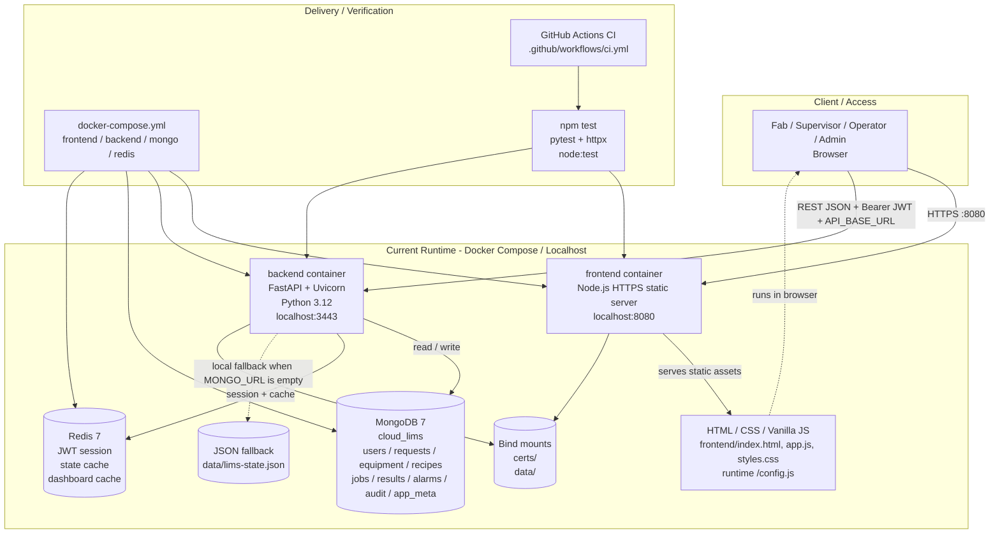
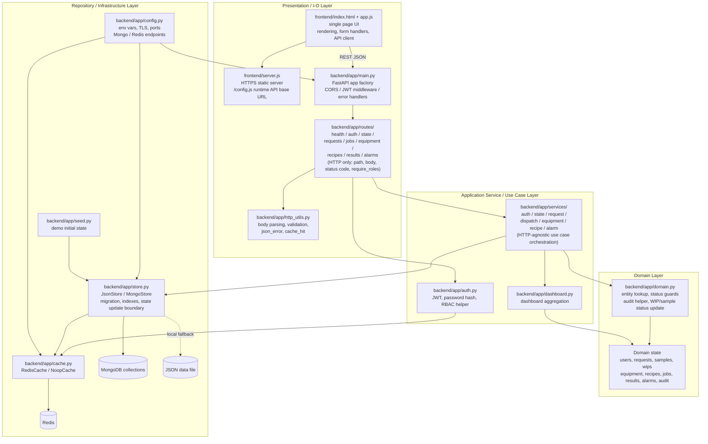
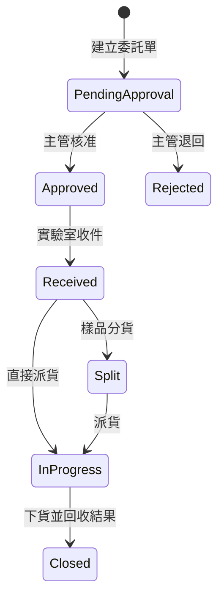

# 目前系統架構

本文件描述目前已實作的 Cloud-Native LIMS Prototype。目標是讓團隊與評審能快速理解：系統現在能跑什麼、用了哪些技術、資料怎麼流、測試與部署做到什麼程度。

## 1. 系統定位

本系統是雲原生實驗室資訊管理系統（Cloud-Native Laboratory Information Management System, LIMS）的 MVP。已支援一條可展示的核心閉環：

```text
登入 -> 建立委託單 -> 主管簽核 -> 實驗室收件 -> 樣品分貨 -> 派貨到機台與 Recipe -> 上貨 -> 下貨 -> 回收結果 -> 自動結案 -> 告警處理
```

目前採前後端分離、容器化、FastAPI 後端、MongoDB 持久化、Redis session/cache、pytest 與 Node frontend tests。

## 2. System Architecture

依照 L05 對 System Architecture 的定義，這一層描述的是整個系統如何在運行環境中持續提供服務，重點是可用性、伸縮性、容錯性、安全邊界、資料與 cache 等 backing services。此專案目前是可展示的 Docker Compose / localhost 架構，尚未進入 DNS、CDN、Load Balancer、Kubernetes 多節點與跨 failure zone 的正式高可用階段。



### L05 對照

| L05 架構關注點 | 目前專案狀態 | 後續演進方向 |
| --- | --- | --- |
| DNS / CDN | 目前為 localhost demo，尚無正式網域與 CDN | 正式部署時可將前端靜態資源放 CDN，API 經 DNS 指到 ingress / load balancer |
| Load Balancer / Reverse Proxy | 目前 frontend、backend 各單一 container | 後端 stateless 化後可水平擴展多個 FastAPI instance，前方加 LB / ingress |
| Application Cluster | 目前單節點，Docker Compose 管理依賴服務 | Kubernetes deployment + replica + readiness/liveness probe |
| Session | JWT 本身 stateless，但 Redis 保存 session jti 以支援 logout / revoke | 多節點 backend 可共用 Redis session，不需 sticky session |
| Cache | Redis 已用於 session、`/api/state` 與 dashboard cache | 擴充 dashboard、查詢與 equipment status cache，並建立 cache invalidation 規則 |
| Database | MongoDB 7，多 collection；本機無 `MONGO_URL` 時 fallback JSON | Production 需 Mongo replica set、備份、索引檢查與資料量成長策略 |
| High Availability | 目前無 HA，服務重啟會造成短暫不可用 | 至少 backend 2 replicas、Mongo replica set、Redis HA、health check 與自動 failover |
| Capacity Planning | 尚未壓測；目前以 MVP demo workload 為假設 | 依 DAU、PV、讀寫比、尖峰 QPS 與單機壓測結果決定 replica 數與 DB 容量 |

### 目前服務

| 服務 | 技術 | Port | 說明 |
| --- | --- | ---: | --- |
| Frontend | Node.js static server, HTML/CSS/Vanilla JS | `8080` | 提供單頁操作介面與 `/config.js` runtime API 設定 |
| Backend | FastAPI, Python 3.12, Uvicorn | `3443` | 提供 REST API、JWT、RBAC、狀態流程 |
| MongoDB | `mongo:7` | `27017` | Docker Compose 模式主要資料庫 |
| Redis | `redis:7-alpine` | `6379` | JWT session、state/dashboard cache |

## 3. Application Architecture

依照 L06 對 Application Architecture 的定義，這一層描述單一應用或子系統內部如何分層，重點是可維護性、可擴充性、可測試性與低耦合高內聚。此專案採前後端分離，後端分為 **router → service → domain → repository** 四層：[backend/app/routes/](../backend/app/routes/) 只處理 HTTP（path / body 解析 / `require_roles` / status code）、[backend/app/services/](../backend/app/services/) 是 HTTP-agnostic 的 use case orchestration、[backend/app/domain.py](../backend/app/domain.py) 是 entity lookup 與狀態 assert 的 pure helper、[backend/app/store.py](../backend/app/store.py) 是 JSON / MongoDB repository。[backend/app/main.py](../backend/app/main.py) 只負責 app factory、middleware、錯誤處理與 router 註冊。



### L06 分層對照

| L06 分層 | 目前對應檔案 | 職責 |
| --- | --- | --- |
| Presentation / Controller | `frontend/index.html`, `frontend/app.js`, `frontend/server.js`, `backend/app/main.py` (app factory + middleware), `backend/app/routes/`, `backend/app/http_utils.py` | UI render、表單操作、HTTP request/response、payload parsing/validation、status code、`require_roles` |
| Application Service | `backend/app/services/` (auth / state / request / dispatch / equipment / recipe / alarm), `backend/app/dashboard.py` | 編排 LIMS use case 流程：開單、簽核、收件、分貨、派貨、上下貨、recipe、告警；不知道 HTTP |
| Domain | `backend/app/domain.py`, `backend/app/seed.py` 的 domain state | 委託單與 job 狀態規則、entity lookup、audit、sample/WIP 狀態變更 |
| Repository / Persistence | `backend/app/store.py` | 封裝 JSON / MongoDB persistence、collection layout、migration、cache invalidation |
| Infrastructure | `backend/app/cache.py`, `backend/app/config.py`, Docker Compose | Redis、環境設定、TLS、port、container backing services |
| Cross-cutting | `backend/app/auth.py`, `backend/app/errors.py` | JWT、RBAC、password hash、API error model |

### Application Architecture 現況判斷

- 已做到前後端分離、REST API、JWT/RBAC、store abstraction、Redis/Noop cache abstraction，測試可直接注入 JSON store。
- 後端已從單一 `main.py` 拆成 `routes/`（HTTP）+ `services/`（business logic）兩個 package，`main.py` 只剩 app factory、middleware、錯誤處理與 router 註冊。多人並行開發時不會集中改同一檔案。
- Service 函式都接 `store` 與具名參數、回 dict、違反規則 raise `ApiError`，將來要加 CLI、機台 event collector 或 background worker 都可直接呼叫 service，不需經 HTTP。
- 後續若進一步演進，可考慮把 service 內共用的查詢函式（例如 `request_by_id` + 狀態檢查組合）獨立成 application service base，或把 audit log 抽成 cross-cutting middleware。

## 4. 程式結構

```text
backend/
  app/
    main.py            FastAPI app factory、CORS / JWT middleware、錯誤處理、router 註冊
    http_utils.py      body 解析、欄位驗證、json_error、cache_hit 等 HTTP 共用 helper
    auth.py            JWT、password hash、Bearer token、RBAC helper
    cache.py           Redis / Noop cache abstraction
    config.py          env var 與 TLS / port / DB 設定
    dashboard.py       dashboard aggregation
    domain.py          entity lookup、audit、狀態驗證 helper（pure helpers）
    errors.py          API error type
    seed.py            demo users 與初始資料
    store.py           JSON store / MongoDB store / migration（repository）
    routes/            HTTP layer：每個資源一個檔案
      health.py        GET /api/health
      auth.py          login / me / logout
      state.py         state / dashboard / reset / audit / equipment GET
      requests.py      委託單 list / create / approve|reject|receive|split|close
      jobs.py          dispatch-jobs / history / load|unload
      equipment.py     equipment status
      recipes.py       recipe create
      results.py       results list / get
      alarms.py        alarms list / ack / simulate
    services/          Application layer：HTTP-agnostic use case orchestration
      auth_service.py
      state_service.py
      request_service.py
      dispatch_service.py
      equipment_service.py
      recipe_service.py
      alarm_service.py
  tests/
    test_api.py        API/RBAC/流程/狀態規則測試
    test_store.py      Mongo collection layout 與 legacy migration 測試

frontend/
  index.html         單頁 UI
  app.js             UI state、API client、render/action handlers
  styles.css         RWD 與視覺樣式
  server.js          HTTPS/static server 與 config.js
  tests/
    server.test.js   frontend static server 測試

docker-compose.yml   frontend / backend / mongo / redis
k8s/                 local Kubernetes manifests for frontend / backend / mongo / redis
.github/workflows/ci.yml
```

## 5. 角色與權限

系統採一人一帳號密碼模型，使用者登入後 JWT 會記錄帳號識別，後端每次 API request 會重新從 store 讀取目前角色，因此 admin 調整身分後會即時套用。新帳號由 admin 建立，預設密碼為 `password123`，使用者登入後可自行更換密碼。

| 角色 | 帳號 | 權限 |
| --- | --- | --- |
| 廠區使用者 | `fab` | 建立委託單、查詢 |
| 實驗室主管 | `supervisor` | 核准 / 退回委託單、設定機台種類 N 與每種台數 K |
| 實驗室人員 | `operator` | 收件、分貨、派貨、上下貨、機台狀態、告警確認 |
| 系統管理員 | `admin` | 管理 Recipe、指派使用者角色、重置 demo data；admin 可通過所有 RBAC 檢查 |

除 `GET /api/health` 與 `POST /api/auth/login` 外，所有 `/api/*` 都需要 `Authorization: Bearer <JWT>`。

## 6. 核心狀態流程



目前後端已補狀態驗證：

- 只有 `pending_approval` 可 approve/reject。
- 只有 `approved` 可 receive。
- 只有 `received` 可 split。
- 只有 `received` 或 `split` 可 dispatch。
- 派貨只能選 `idle` 機台；派貨後機台狀態立刻變 `running`。
- `alarm` / `maintenance` 機台不可派貨；處理後可由 operator 設回 `idle`。
- `running` 機台不可手動設為 `idle`，必須透過下貨或 machine completed event 完成。
- 機台使用率以「同 type 中 `running` 台數 / 該 type 全部台數」計算。
- job 只有 `queued` 可 load，只有 `running` / `loaded` 可 unload。

## 7. 主要 API

| Method | Path | 權限 | 說明 |
| --- | --- | --- | --- |
| `GET` | `/api/health` | public | 健康檢查 |
| `POST` | `/api/auth/login` | public | 登入取得 JWT |
| `GET` | `/api/auth/me` | authenticated | 查目前登入者 |
| `POST` | `/api/auth/logout` | authenticated | 登出並撤銷 Redis session |
| `PATCH` | `/api/auth/password` | authenticated | 登入者更換自己的密碼 |
| `GET` | `/api/state` | authenticated | 取得完整 demo state |
| `GET` | `/api/dashboard` | authenticated | Dashboard aggregation |
| `GET` | `/api/audit?limit=20` | authenticated | 查操作歷程 |
| `POST` | `/api/users` | `admin` | 建立使用者帳號，預設密碼 `password123` |
| `GET` | `/api/users` | `admin` | 查使用者與目前角色 |
| `PATCH` | `/api/users/{id}/role` | `admin` | 指派使用者角色 |
| `POST` | `/api/requests` | `fab` | 建立委託單 |
| `POST` | `/api/requests/{id}/approve` | `supervisor` | 核准 |
| `POST` | `/api/requests/{id}/reject` | `supervisor` | 退回 |
| `POST` | `/api/requests/{id}/receive` | `operator` | 實驗室收件 |
| `POST` | `/api/requests/{id}/split` | `operator` | 自動分貨 |
| `POST` | `/api/dispatch-jobs` | `operator` | 派貨到機台與 Recipe |
| `GET` | `/api/dispatch-jobs/{id}/history` | authenticated | 查上下貨歷史 |
| `POST` | `/api/dispatch-jobs/{id}/load` | `operator` | 上貨 |
| `POST` | `/api/dispatch-jobs/{id}/unload` | `operator` | 下貨、產生 result、自動結案 |
| `POST` | `/api/equipment/{id}/status` | `operator` | 更新機台狀態 |
| `PUT` | `/api/equipment/types` | `supervisor` | 設定機台種類與每種台數 |
| `POST` | `/api/recipes` | `admin` | 新增 Recipe |
| `GET` | `/api/results` | authenticated | 查結果 |
| `GET` | `/api/results/{id}` | authenticated | 查單筆結果 |
| `POST` | `/api/alarms/simulate` | `operator` | 模擬告警 |
| `POST` | `/api/alarms/{id}/ack` | `operator` | 確認告警 |
| `POST` | `/api/reset` | `admin` | 重置 demo data |

## 8. 資料儲存

Docker Compose 模式使用 MongoDB，資料拆成多個 collection：

```text
users
requests
equipment
recipes
jobs
results
alarms
audit
app_meta
```

`app_meta` 保存 schema version 與 request/job/recipe/alarm 序號。若舊資料仍在 legacy `app_state` document，後端第一次啟動時會自動遷移到新的 collection layout。

未設定 `MONGO_URL` 時使用 JSON fallback：`data/lims-state.json`。這主要給本機開發與測試使用。

## 9. 測試現況

Root command：

```bash
npm test
```

目前會依序執行：

```bash
npm run test:backend
npm run test:frontend
```

Backend tests：

- `backend/tests/test_api.py`
- `backend/tests/test_store.py`
- 涵蓋 auth、JWT expiry、RBAC、使用者建立 / 角色管理 / 自助改密碼、完整 LIMS 流程、狀態轉換、派貨限制、告警、Recipe 管理、Mongo migration。

Frontend tests：

- `frontend/tests/server.test.js`
- 涵蓋 frontend static server、`config.js`、content type、404、405、path traversal 防護。

## 10. 目前限制

| 類別 | 限制 |
| --- | --- |
| 使用者管理 | 已支援 admin 新增帳號、指派角色與使用者自助改密碼；尚未支援停用使用者或 admin 代重設密碼 |
| Observability | 目前只有 health check，尚無 metrics/log format/tracing |
| Docker/K8s | 有 Docker Compose 與本機 Kubernetes manifests；尚未有 production ingress、HA Redis/Mongo、metrics/tracing |
