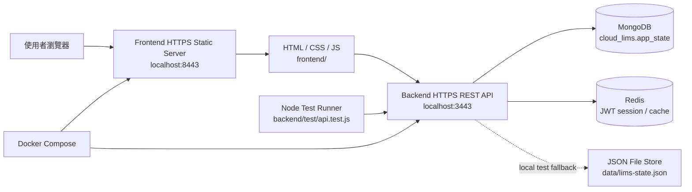
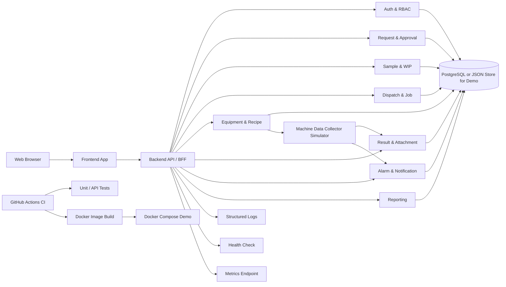

# LIMS 專案執行與分工計畫

本文件整理目前已完成內容、五位組員分工、系統架構圖，以及後續要增加的功能應該修改哪些檔案與如何修改。目標是讓每位組員可以直接依照自己的區塊開發與 demo。

## 1. 目前完成內容

| 類別 | 已完成內容 | 對應檔案 |
| --- | --- | --- |
| 題目需求整理 | 已根據課程 PDF 整理 LIMS 核心需求與進階需求，包括開單、簽核、收件、分貨、派貨、機台 Recipe、結果回收、統計與告警 | `docs/architecture.md` |
| 前端 Prototype | 已完成可互動頁面，支援 dashboard、委託開單、簽核中心、收件與派貨、機台 Recipe、結果與統計，並可獨立部署 | `frontend/index.html`, `frontend/app.js`, `frontend/styles.css`, `frontend/server.js` |
| API Server | 已建立 Node.js REST API，支援核心 demo 流程，且已拆成多個後端模組方便分工 | `backend/server.js`, `backend/src/` |
| Auth / JWT | 已加入登入 API、JWT 簽發與驗證，除 health/login 外 API 都需要 Bearer token | `backend/src/auth.js`, `backend/src/routes/auth.js`, `frontend/app.js` |
| Redis 快取 | 已加入 Redis session/cache，JWT session、state/dashboard cache 會寫入 Redis | `backend/src/cache.js`, `backend/src/routes/queries.js`, `docker-compose.yml` |
| 資料保存 | Docker Compose 使用 MongoDB；本機測試可 fallback 到 JSON 檔 | `backend/src/store.js`, `data/lims-state.json`, `docker-compose.yml` |
| 測試 | 已有 API 測試，驗證開單到自動結案與告警流程 | `backend/test/api.test.js` |
| 容器化 | 已可用 Docker Compose 啟動 frontend、backend、MongoDB、Redis | `frontend/Dockerfile`, `backend/Dockerfile`, `docker-compose.yml` |
| 文件 | 已有 README、架構草案、五人分工草案 | `README.md`, `docs/architecture.md`, `docs/team-division.md` |

目前已可展示的完整流程：

```text
建立委託單 -> 主管簽核 -> 實驗室收件 -> 樣品分貨 -> 派貨到機台與 Recipe -> 上貨 -> 下貨 -> 回收數據 -> 自動結案
```

## 2. 系統架構圖

### 2.1 目前前後端分離 MVP 架構



目前架構已做到部署層級的前後端分離：frontend 只負責畫面與靜態檔案，backend 只負責 REST API、JWT 驗證、Redis cache 與 MongoDB 資料保存。限制是 RBAC 細節、CI/CD 與監控仍未正式化。

### 2.2 期末目標架構



實作策略：目前已完成前後端分離與後端拆檔。前端功能請修改 `frontend/`，後端功能請修改 `backend/src/routes/*.js`、`backend/src/domain.js`、`backend/src/store.js` 等模組，避免把業務邏輯放回 `backend/server.js`。

## 3. 五人分工總表

| 成員 | 角色 | 目前已完成可認領內容 | 接下來要增加的內容 | 主要檔案 |
| --- | --- | --- | --- | --- |
| A | 組長 / 架構 / DevOps | Docker、Compose、README、架構文件 | CI/CD、health check 文件、部署圖、監控說明、Docker 優化 | `README.md`, `backend/Dockerfile`, `frontend/Dockerfile`, `docker-compose.yml`, `.github/workflows/ci.yml`, `docs/architecture.md` |
| B | 前端 / UX | 目前所有前端頁面與 RWD 操作介面 | 權限化 UI、手動分貨表單、更多統計圖、操作歷史顯示強化 | `frontend/index.html`, `frontend/app.js`, `frontend/styles.css`, `frontend/server.js` |
| C | 後端 - Auth / 開單 / 簽核 / 權限 | JWT Auth、Request API、approve/reject API、audit 基礎紀錄 | 使用者與角色權限、簽核意見、簽核時間、audit log 查詢 API | `backend/src/auth.js`, `backend/src/routes/auth.js`, `backend/src/routes/requests.js`, `backend/src/domain.js`, `backend/src/seed.js`, `backend/test/api.test.js` |
| D | 後端 - 樣品 / WIP / 派貨 | 收件、分貨、dispatch job、load/unload 流程 | 手動 WIP 分貨、上下貨歷史查詢、派貨限制、狀態轉換驗證 | `backend/src/routes/requests.js`, `backend/src/routes/dispatch-jobs.js`, `frontend/app.js`, `backend/test/api.test.js` |
| E | 機台 / Recipe / 結果 / 測試 | Equipment、Recipe、Result、Alarm 基礎 API 與測試 | Recipe 版本管理、機台 collector 模擬、統計 API、告警規則、更多測試 | `backend/src/routes/equipment.js`, `backend/src/routes/recipes.js`, `backend/src/routes/alarms.js`, `backend/src/dashboard.js`, `backend/test/api.test.js` |

## 4. 成員 A：架構、DevOps、文件

### 目前已完成

- 已有 `backend/Dockerfile` 與 `frontend/Dockerfile`，可分別建立後端與前端 image。
- 已有 `docker-compose.yml`，可用 `docker compose up --build` 同時啟動 frontend、backend、MongoDB、Redis。
- 已有本機自簽憑證，frontend/backend 皆使用 HTTPS。
- 已有 `/api/health` health check。
- 已有 `README.md` 說明啟動、測試、Docker。
- 已有 `docs/architecture.md` 架構草案。

### 要增加的內容

| 要增加項目 | 修改或新增檔案 | 如何增加 |
| --- | --- | --- |
| GitHub Actions CI | 新增 `.github/workflows/ci.yml` | 設定 push / pull request 時執行 `npm test`、`docker compose build`，確保測試與兩個 image build 都成功 |
| Backend health check | 修改 `backend/Dockerfile` | 加入 `HEALTHCHECK CMD node -e "fetch('https://127.0.0.1:3443/api/health', {agent: insecureAgent}).then(r=>process.exit(r.ok?0:1)).catch(()=>process.exit(1))"` |
| Compose 穩定性 | 修改 `docker-compose.yml` | frontend/backend/mongo/redis 加入 `restart: unless-stopped`，MongoDB 保留 named volume |
| 部署說明 | 修改 `README.md` | 補上 demo 前啟動、停止、重建、清空資料的指令 |
| 架構簡報素材 | 修改 `docs/architecture.md` | 補上目前 MVP 架構與期末目標架構差異，說明為何先做 modular monolith |

### 建議驗收標準

- `npm test` 通過。
- `docker compose up --build` 可正常啟動 frontend 與 backend。
- `https://localhost:8443/` 可開啟前端。
- `curl -k https://localhost:3443/api/health` 回傳 `{"status":"ok","store":"mongodb","cache":"redis"}`。
- 登入後 API request 會帶 `Authorization: Bearer <JWT>`。
- `docker compose exec -T redis redis-cli DBSIZE` 可看到 session/cache key。
- `docker compose exec -T mongo mongosh --quiet --eval 'db.getSiblingDB("cloud_lims").app_state.countDocuments()'` 回傳 `1`。
- README 中任何組員照指令都能成功跑起系統。

## 5. 成員 B：前端與使用者流程

### 目前已完成

- 已有 sidebar、dashboard、委託開單、簽核中心、收件派貨、機台 Recipe、結果統計頁。
- 已可呼叫 API，API 不可用時會 fallback 成純前端 demo。
- 已有 RWD CSS，可在手機寬度下轉成單欄。

### 要增加的內容

| 要增加項目 | 修改或新增檔案 | 如何增加 |
| --- | --- | --- |
| 角色權限 UI | 修改 `frontend/app.js` | 依 `state.currentRole` 控制按鈕是否顯示，例如廠區使用者只能開單，主管才能核准，實驗室人員才能收件與派貨 |
| 權限提示樣式 | 修改 `frontend/styles.css` | 增加 `.disabled-action` 或 `.permission-note`，讓不能操作的角色看到明確狀態 |
| 手動分貨表單 | 修改 `frontend/index.html` | 在「收件與分貨」區塊加入 WIP 數量、用途欄位，讓使用者不是只能自動切兩份 |
| 手動分貨 API 串接 | 修改 `frontend/app.js` | 在 `splitRequest` 改成收集表單資料，呼叫 `POST /api/requests/:id/split`，body 帶 `wips` 陣列 |
| 統計圖強化 | 修改 `frontend/index.html`, `frontend/app.js`, `frontend/styles.css` | 在「結果與統計」增加委託單狀態統計、人員操作統計，不只顯示機台利用率 |
| 操作歷史顯示 | 修改 `frontend/app.js` | 在 job card 顯示完整 `job.history`，目前已初步顯示，後續可改成 timeline |

### 建議驗收標準

- 切換角色時，不同角色看到的可操作按鈕不同。
- 手動分貨可輸入 WIP 數量與用途。
- Dashboard 至少有三種統計：待簽核、機台利用率、委託單狀態分布。
- 手機版沒有文字擠出或按鈕重疊。

## 6. 成員 C：委託單、簽核、權限與 Audit

### 目前已完成

- `POST /api/requests` 可建立委託單。
- `POST /api/requests/:id/approve` 可核准。
- `POST /api/requests/:id/reject` 可退回。
- `audit` 已可記錄操作訊息、actor、occurredAt。

### 要增加的內容

| 要增加項目 | 修改或新增檔案 | 如何增加 |
| --- | --- | --- |
| 使用者資料 | 修改 `backend/src/seed.js` 的 `createInitialState()` | 新增 `users` 陣列，包含 `id`, `name`, `role`, `department`, `site` |
| 權限檢查 | 修改 `backend/src/domain.js`, `backend/src/routes/requests.js`, `backend/src/routes/dispatch-jobs.js` | 新增 `requireRole(actorRole, allowedRoles)` helper，在 approve/reject/receive/dispatch 等 route 檢查角色 |
| 前端送角色 | 修改 `frontend/app.js` | 在 `actorPayload()` 內加入 `role: state.currentRole`，讓 API 可以判斷權限 |
| 簽核意見 | 修改 `frontend/index.html`, `frontend/app.js`, `backend/src/routes/requests.js` | 前端退回時帶 reason；server 在 request 上保存 `approvalComment`, `approvedBy`, `approvedAt`, `rejectedBy`, `rejectedAt` |
| Audit 查詢 API | 修改 `backend/src/routes/queries.js` | 新增 `GET /api/audit`，回傳 `state.audit`，可支援 `?limit=20` |
| 測試 | 修改 `backend/test/api.test.js` | 增加測試：非主管不能核准；退回必須保存 reason；audit 有正確 actor |

### 建議驗收標準

- 主管角色才能核准或退回。
- 每次簽核都記錄簽核人、時間、意見。
- `GET /api/audit` 可查到最新操作紀錄。
- 測試涵蓋成功與失敗權限情境。

## 7. 成員 D：樣品、WIP、派貨與上下貨歷史

### 目前已完成

- `POST /api/requests/:id/receive` 可收件。
- `POST /api/requests/:id/split` 可自動切 WIP。
- `POST /api/dispatch-jobs` 可建立派貨任務。
- `POST /api/dispatch-jobs/:id/load` 可上貨。
- `POST /api/dispatch-jobs/:id/unload` 可下貨、回收資料並自動結案。

### 要增加的內容

| 要增加項目 | 修改或新增檔案 | 如何增加 |
| --- | --- | --- |
| 手動 WIP 分貨 | 修改 `backend/src/routes/requests.js` | 在 split route 支援 body.wips，例如 `[{ quantity: 1, purpose: "baseline" }]`，驗證總量不可超過 sample quantity |
| 分貨 UI 串接 | 修改 `frontend/index.html`, `frontend/app.js` | 前端新增分貨欄位，送出時把 WIP 陣列傳給 API |
| 狀態轉換驗證 | 修改 `backend/src/domain.js`, `backend/src/routes/requests.js`, `backend/src/routes/dispatch-jobs.js` | 新增 helper `assertRequestStatus(request, allowedStatuses)`，避免未核准就收件、未收件就派貨 |
| 派貨限制 | 修改 `backend/src/routes/dispatch-jobs.js` | 派貨時檢查機台不能是 `maintenance` 或 `alarm`，Recipe 必須屬於該機台 |
| 上下貨歷史 API | 修改 `backend/src/routes/dispatch-jobs.js` | 新增 `GET /api/dispatch-jobs/:id/history`，回傳指定 job history |
| 測試 | 修改 `backend/test/api.test.js` | 增加測試：WIP 分貨總量超過樣品數量要失敗；異常機台不可派貨；Recipe 不屬於機台不可派貨 |

### 建議驗收標準

- 分貨數量總和不可超過樣品數量。
- 不可跳過簽核直接收件。
- 不可派貨到異常或保養機台。
- 上貨與下貨歷史可在畫面與 API 查到。

## 8. 成員 E：機台、Recipe、結果、告警與測試

### 目前已完成

- `POST /api/equipment/:id/status` 可改機台狀態。
- `POST /api/recipes` 可新增 Recipe。
- 下貨時會建立 result，包含 raw data URI 與 report URI。
- `POST /api/alarms/simulate` 可模擬告警。
- `POST /api/alarms/:id/ack` 可確認告警。
- `backend/test/api.test.js` 已涵蓋核心流程與告警確認。

### 要增加的內容

| 要增加項目 | 修改或新增檔案 | 如何增加 |
| --- | --- | --- |
| Recipe 版本管理 | 修改 `backend/src/routes/recipes.js`, `frontend/app.js` | 新增 `PUT /api/recipes/:id` 或 `POST /api/recipes/:id/deactivate`，讓舊版本可停用，只允許 active recipe 派貨 |
| 機台資料 collector 模擬 | 新增 `backend/src/routes/machine-events.js`，並修改 `backend/src/routes/index.js` | 新增 `POST /api/machine-events`，body 包含 `jobId`, `equipmentId`, `eventType`, `payload`；當 eventType 是 `completed` 時自動 unload |
| 結果查詢 API | 修改 `backend/src/routes/queries.js` | 新增 `GET /api/results` 與 `GET /api/results/:id`，讓結果管理頁可以查單筆結果 |
| 統計 API | 修改 `backend/src/dashboard.js`, `backend/src/routes/queries.js` | 擴充 `GET /api/dashboard`，回傳 request status count、operator action count、equipment utilization |
| 告警規則 | 修改 `backend/src/routes/machine-events.js`, `backend/src/routes/alarms.js` | 在 machine event 中如果 payload 超過門檻，建立 alarm，例如 `temperature > threshold` |
| 測試強化 | 修改 `backend/test/api.test.js` | 增加測試：machine event completed 會自動產生 result；alarm event 會產生告警；inactive recipe 不可派貨 |

### 建議驗收標準

- Recipe 可以新增版本、停用舊版本。
- 機台 completed event 可以自動完成 job 並產生 result。
- 告警 event 可以自動建立 alarm。
- 統計 API 可以支援 Dashboard 圖表。

## 9. 建議新增或修改檔案清單

| 檔案 | 負責人 | 修改目的 | 具體做法 |
| --- | --- | --- | --- |
| `.github/workflows/ci.yml` | A | CI/CD | 新增 workflow，執行 `npm test` 與 `docker compose build` |
| `backend/Dockerfile` | A | 後端容器可靠性 | 加入 `HEALTHCHECK` |
| `frontend/Dockerfile` | A | 前端容器 | 打包 `frontend/` 靜態頁面與前端 server |
| `docker-compose.yml` | A | Demo 穩定性 | 加入 `restart: unless-stopped`，確認 volume 保留 |
| `README.md` | A | 使用說明 | 補上 demo script、常見錯誤、port 被占用處理 |
| `docs/architecture.md` | A | 架構說明 | 加入目前 MVP 架構、期末目標架構、模組說明 |
| `frontend/index.html` | B | UI 功能 | 加入手動分貨欄位、簽核意見欄位、更多統計區塊 |
| `frontend/app.js` | B, C, D, E | API 串接與 UI 行為 | 角色權限顯示、手動分貨資料收集、machine event 串接、統計資料渲染 |
| `frontend/styles.css` | B | RWD 與視覺 | 補分貨表單、統計圖、權限提示、timeline 樣式 |
| `frontend/server.js` | A, B | 前端靜態服務與 API 設定 | 只提供前端檔案與 `config.js`，透過 `API_BASE_URL` 指向後端 |
| `backend/server.js` | A | Server 入口 | 只放 createServer 與啟動邏輯，後續避免塞業務邏輯 |
| `backend/src/config.js` | A | Backend 設定 | 管理 port 與 data file |
| `backend/src/auth.js` | C | JWT 與密碼驗證 | 管理 password hash、JWT sign/verify、Bearer token 驗證 |
| `backend/src/cache.js` | A, E | Redis cache | 管理 Redis GET/SETEX/DEL，供 JWT session 與 dashboard cache 使用 |
| `backend/src/store.js` | A, C | 資料存取 | 管理 MongoDB store；未設定 MongoDB 時 fallback JSON store |
| `backend/src/seed.js` | C | 初始資料 | 新增 users、角色、demo data、測試帳號 |
| `backend/src/domain.js` | C, D, E | 共用 domain helper | 放查找 entity、audit、狀態驗證、權限 helper |
| `backend/src/routes/auth.js` | C | Auth API | 登入、查詢目前使用者、登出撤銷 Redis session |
| `backend/src/routes/queries.js` | A, E | 查詢 API | health、state、dashboard、results、audit 查詢 |
| `backend/src/routes/requests.js` | C, D | 委託單/簽核/收件/分貨 | 增加權限、簽核意見、手動分貨 |
| `backend/src/routes/dispatch-jobs.js` | D | 派貨/上下貨 | 增加派貨限制、上下貨歷史 API |
| `backend/src/routes/equipment.js` | E | 機台狀態 | 增加保養紀錄、告警規則串接 |
| `backend/src/routes/recipes.js` | E | Recipe | 增加版本管理與停用 |
| `backend/src/routes/alarms.js` | E | 告警 | 增加告警確認、通知與規則 |
| `backend/src/routes/index.js` | A | API route 組裝 | 新增 route 檔時要在這裡掛入 handler |
| `backend/test/api.test.js` | C, D, E | 測試驗證 | 增加權限、分貨、派貨限制、machine event、recipe version、告警規則測試 |
| `data/lims-state.json` | 全員 | Demo 資料 | 不直接手動改，透過 API 產生；需要重置時呼叫 `POST /api/reset` |

## 10. 建議開發順序

| 順序 | 目標 | 主要負責 | 完成標準 |
| --- | --- | --- | --- |
| 1 | 補 CI 與 Docker health check | A | PR 時自動跑測試，Docker image 可 build |
| 2 | 補角色權限與簽核意見 | B, C | 主管才能核准，退回可填原因 |
| 3 | 補手動分貨與狀態驗證 | B, D | WIP 數量可手動輸入，錯誤狀態不可操作 |
| 4 | 補 Recipe 版本與機台事件 | E | inactive recipe 不可派貨，machine event 可自動完成 job |
| 5 | 補統計圖與報表 API | B, E | Dashboard 顯示委託單狀態、人員操作、機台利用率 |
| 6 | 補完整測試與 demo script | 全員 | `npm test` 通過，能順利展示完整流程 |

## 11. Demo 分工建議

| Demo 段落 | 展示者 | 展示內容 |
| --- | --- | --- |
| 系統架構與部署 | A | Docker Compose、health check、架構圖、CI/CD |
| 使用者開單與 UI | B | RWD、建立委託單、Dashboard |
| 主管簽核與 Audit | C | 核准、退回、簽核意見、audit log |
| 收件、分貨、派貨 | D | 收件、手動 WIP、派貨、上下貨歷史 |
| 機台、結果、告警 | E | Recipe、machine event、結果回收、自動結案、告警確認 |

## 12. 組員開發規則

- 每個人修改前先跑 `npm test`，修改後也要跑一次。
- 修改 API 時同步更新 `backend/test/api.test.js`。
- 修改 UI 時至少檢查桌面寬度與手機寬度。
- 不直接手動編輯 `data/lims-state.json` 作為正式功能，demo 資料應透過 API 建立。
- 若多人同時改同一個 route 檔，請先確認負責區段，避免互相覆蓋。
- `backend/server.js` 只作為入口使用，後續不要把新 API 邏輯加回 `backend/server.js`。
