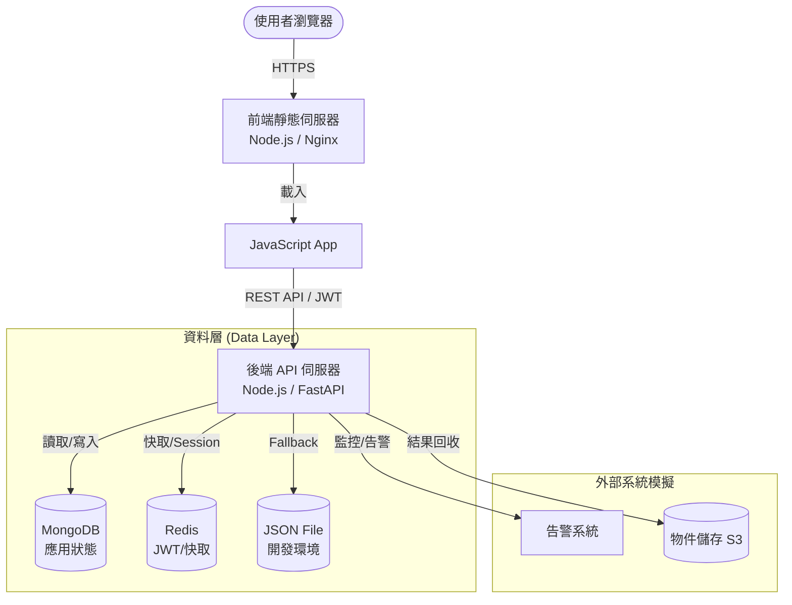
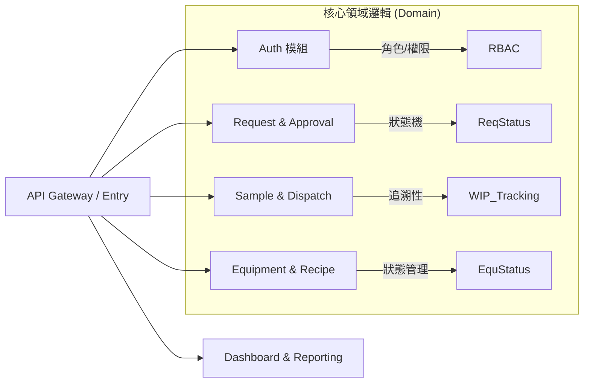
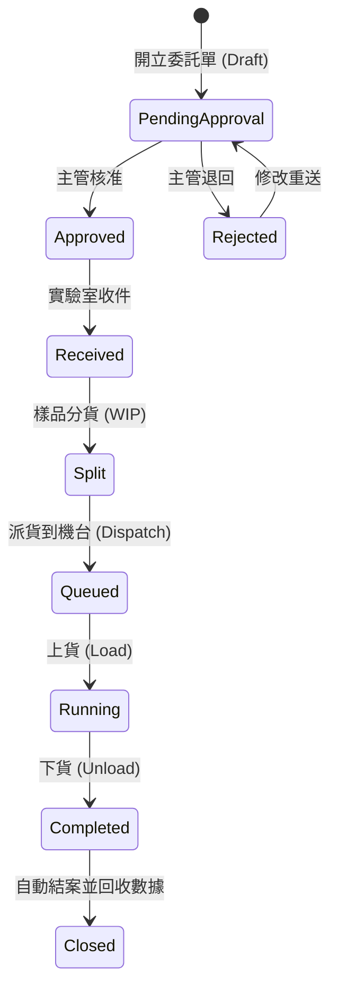

# 實驗室資訊管理系統 (LIMS) 系統架構說明書

本文件詳細說明雲原生實驗室資訊管理系統 (Cloud-Native LIMS) 的技術架構、組件設計、資料流與安全性設計。

## 1. 系統概述
本系統旨在數位化半導體廠實驗室的作業流程，涵蓋從委託開單、簽核、收件、分貨 (WIP)、派貨 (Dispatch) 到實驗執行與結果回收的全生命週期管理。

## 2. 核心架構圖

### 2.1 高層級部署架構
系統採用前後端分離與容器化部署設計。

### 2.2 後端模組化設計
後端採用 Modular Monolith (模組化單體) 設計，方便未來擴展為微服務。

## 3. 核心資料流程 (Data Flow)

### 3.1 實驗委託全生命週期
從委託到結案的狀態流轉。

## 4. 技術棧 (Technology Stack)

| 層級 | 技術 | 說明 |
| :--- | :--- | :--- |
| **前端 (Frontend)** | HTML5, CSS3, Vanilla JS | 追求效能與零外部依賴，支援 RWD 回應式設計。 |
| **後端 (Backend)** | Node.js (main) / FastAPI (Python branch) | 提供 RESTful API 與 JWT 驗證。 |
| **資料庫 (Database)** | MongoDB | 儲存靈活的 JSON 結構資料 (委託單、機台紀錄)。 |
| **快取 (Cache)** | Redis | 用於儲存 JWT Session 與 Dashboard 快取。 |
| **容器化 (DevOps)** | Docker & Docker Compose | 確保開發環境與生產環境一致性。 |
| **通訊 (Security)** | HTTPS / TLS | 全程加密傳輸。 |

## 5. 安全性設計 (Security)

1.  **認證 (Authentication)**：
    *   使用 **JWT (JSON Web Token)**。
    *   登入成功後簽發 Token，有效期 1 小時。
    *   Session 資訊儲存於 Redis，支援登出即時失效。

2.  **授權 (Authorization)**：
    *   **RBAC (基於角色的存取控制)**。
    *   `fab`: 僅能開單與查詢。
    *   `supervisor`: 核准/退回權限。
    *   `operator`: 收件、分貨、操作機台。
    *   `admin`: 系統管理。

3.  **稽核 (Audit)**：
    *   所有重要操作（簽核、狀態變更、登入）皆會記錄於 `audit` 檔，包含操作人與時間戳。

## 6. 未來擴展計畫
*   **API Gateway**：引入 Nginx 或 Kong 作為統一入口與負載均衡。
*   **可觀測性**：整合 Prometheus 與 Grafana 監控機台利用率。
*   **事件驅動**：引入 MQTT 或 Kafka 處理機台自動回傳數據。
